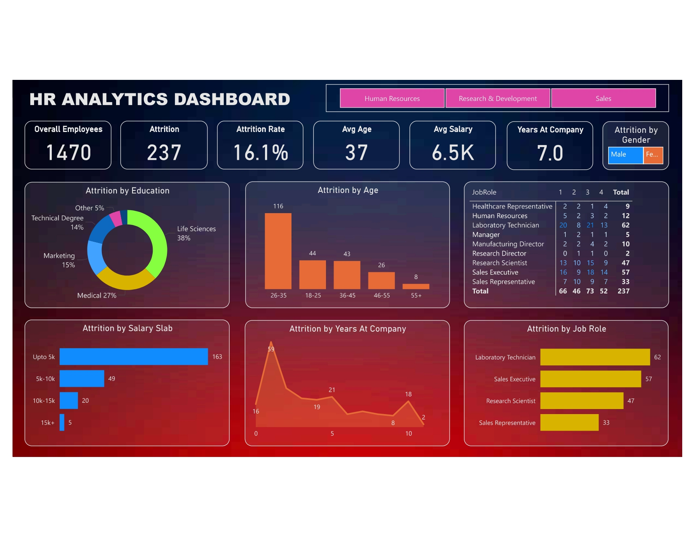

# HR_Analytics-Dashboard
## 📌 Project Overview
An interactive dashboard created in Power BI to help HR teams identify reasons behind employee attrition and guide data-driven retention strategies.

## 🔍 Problem Statement
The organization was experiencing high employee turnover but lacked clarity on the main drivers causing it.

## ⚙️ Methodology
- Cleaned and processed 1,000+ employee records in Power BI.
- Built measures using DAX and added filters for salary, gender, department, and education.
- Developed an interactive dashboard to explore attrition trends visually.
- Analyzed segment-wise trends for actionable business insight.

## 📈 Key Insights
- 68% of employees who left were earning below ₹5,000/month.
- Some departments and job roles showed higher turnover.
- HR can use these insights to plan salary changes and role-specific retention programs.

## 🖼️ Dashboard Preview

## 🧰 Tools Used
Power BI · DAX · Power Query

